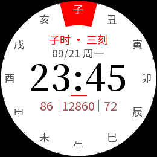
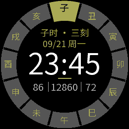
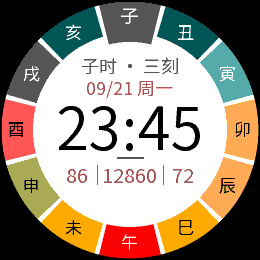
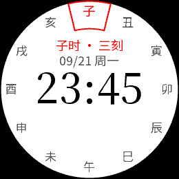
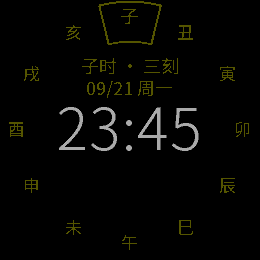
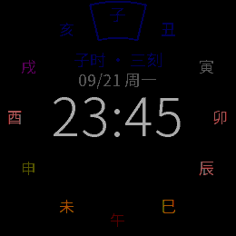

# 十二时辰 · Garmin 圆屏表盘

三个独立的 Connect IQ 原生表盘，按 `designs/shichen-watchface/十二时辰表盘-三版对照.html` 实现，共用时间与绘制逻辑。

| 应用目录 | 风格 | 字体与配色 |
|---|---|---|
| `hour-white` | 宣纸留白 | 浅色盘面、朱砂当前时辰、宋体时间 |
| `hour-black` | 玄天黑金 | 深色盘面、金色当前时辰、无衬线时间 |
| `hour-color` | 十二时辰色 | 十二分区独立配色，中央强调色随时辰变化 |

外圈顶部为子时，顺时针排列。当前分区向内延伸约 7% 半径，外沿位置不变。中央显示时辰刻数、日期、时间，下方一行「电量 ｜ 步数 ｜ 心跳」，三项固定锚点，位数变化时位置不跳。

## 效果图

Forerunner 255 标准版的 260 × 260 像素预览（子时·三刻 23:45，固定日期 09/21 周一）。原型直接复用正式包的圆环、字形和定位资源，以下图片由 `designs/shichen-watchface/export-previews.mjs` 导出：

| 状态 | 宣纸留白 `hour-white` | 玄天黑金 `hour-black` | 十二时辰色 `hour-color` |
|---|---|---|---|
| 正常 |  |  |  |
| 常亮省电 |  |  |  |

打开 [三版交互原型](designs/shichen-watchface/十二时辰表盘-三版对照.html)，可切换时间、尺寸、电量、心率、步数和省电状态。默认「260px + 思源黑体 + MIP 64 色」展示 FR255 标准版的实际像素资源；其他尺寸及候选字体使用矢量预览。`png/` 同时保留三款 454px 全彩预览。

原型与成品的环上时辰字、小注、日期与数据行均默认使用 **Noto Sans SC**；白款时间为 Noto Serif SC，其他两款时间为 Noto Sans SC。启动器图标使用霞鹜文楷；原型保留其他字体作为候选对照。字体来源和授权见 [字体说明](shared/licenses/README.md)。

Forerunner 255 标准版使用专用像素资源：圆环以 8 倍采样生成后缩到 260px，中文和数字的边缘预先与背景混合，再映射到设备的 64 色。小字采用 400 字重，无衬线时间正常/省电为 350/300，白款衬线时间为 600/450，改善圆环台阶、中文笔画粗细跳变及数字硬边。其他设备沿用通用绘制资源。

2026-09-23 已获得 FR255 标准版真机效果明显改善的反馈。三主题共 21 项 SDK 原生测试通过，8 张原生截图与资源合成结果逐像素一致；本页六张 FR255 图也与对应原生截图一致。反射屏在环境光下的显色和续航仍以真机为准。原生验证范围与生成方式见 [FR255 绘制说明](plans/FR255_RENDERING.md)。

## 时间、数据与省电

- 读取手表本地时间；数字时间固定 24 小时制，不跟随系统设置，与时辰环的 24 小时刻度一致。
- 每刻 15 分钟，从初刻到七刻；23:00 子时初刻，23:45 子时三刻，00:00 子时四刻，01:00 丑时初刻。
- 日期在当地午夜切换。步数读取系统当日统计；心率优先使用当前有效读数，否则取五分钟内的最新有效历史样本，没有有效读数显示 `--`。
- 电量不高于 20% 时用朱砂色提示；心率只显示数字，不添加图标或单位。
- 普通省电状态按原型取消分区填充，只保留当前分区描边，并隐藏数据行和强调线。
- 设备报告 `requiresBurnInProtection` 时，省电状态直接全黑，抬腕后恢复完整画面。省电刷新不读取底部健康数据，不使用秒级定时器或后台服务。
- 只纳入官方资料中 `round` 且支持 `watchFace` 的设备。具体设备资料与验证范围见 `plans/DEVICES.md`。
- 按确认排除 Forerunner 45、Forerunner 55、Garmin Swim 2 三款 8 色机型。其余 MIP 严格映射原型颜色，因此白款普通分区可能与背景合并；当前时辰仍有强调色及向内延伸。

## 本地环境

自动准备脚本适用于 macOS Apple Silicon，使用项目内 Java 17、Connect IQ SDK 9.2.0 和 Python 虚拟环境，不替换系统工具。

```sh
python3 scripts/bootstrap.py
python3 scripts/device_status.py
python3 scripts/generate_resources.py
```

设备包由官方 SDK Manager 下载。资源生成器只使用已安装的纯圆屏设备资料，下载新机型后需要重新生成；生成器不会自动宣称所有官方型号已覆盖。

可通过 `CIQ_SDK` 指定 SDK 目录，通过 `CIQ_SIGNING_KEY` 指定已有开发签名密钥。设备资料使用 SDK Manager 的标准安装位置。

首次构建会生成 `.tools/signing/developer_key.der`。同一应用的后续更新应继续使用这把密钥，请单独备份；源码和交付包不包含私钥。

## 构建与验证

```sh
# 三个主题，默认覆盖九种屏幕尺寸的代表设备
python3 scripts/build.py --debug

# 指定设备与主题
python3 scripts/build.py --theme hour-white --device fenix9pro51mm

# Forerunner 255 标准版：三个主题正式 PRG
python3 scripts/build.py --device fr255

# 本机全部符合条件的机型
python3 scripts/build.py --all

# 字形覆盖、文字占位、应用 ID、原型规则一致性
python3 -m unittest discover -s tests -p 'test_*.py'

# 原生测试：先在官方模拟器中打开 ConnectIQ.app
python3 scripts/build.py --device fr255 --test
python3 scripts/simulate.py --theme hour-white --device fr255 --test
python3 scripts/simulate.py --theme hour-black --device fr255 --test
python3 scripts/simulate.py --theme hour-color --device fr255 --test

# 正常读取模拟器系统数据
python3 scripts/simulate.py --theme hour-white --device fenix9pro51mm
```

模拟器程序位于 `.tools/sdk/bin/ConnectIQ.app`。`simulate.py` 运行普通表盘时会一直连接到该应用结束；从模拟器 File → Kill App 结束当前实例后可切换目标。模拟器产生的心率、步数用于开发验证，不是实表测量数据。

构建日志在 `build/<模式>/<主题>/<设备>.log`，本次批次汇总在对应目录的 `report.json`。原生测试另保存 `.simulation.log` 和 `.test-result.json`；SDK 的测试成功汇总才是通过依据。

资源生成时会同步原型的 `fr255-raster.js`。若只更新原型与 README 配图，可执行：

```sh
python3 scripts/mip_resources.py --prototype-only
node designs/shichen-watchface/export-previews.mjs
```

PNG 导出使用本机 Microsoft Edge（可通过 `EDGE_BIN` 指定路径），无需启动网页服务或安装 Node 依赖。260px 图片保留原始像素，454px 图片展示通用全彩字体与布局。

## 固定数据验收

```sh
python3 scripts/preview.py --theme hour-color --device fenix9pro51mm --scene normal
python3 scripts/simulate.py --device fenix9pro51mm --file build/preview/hour-color/fenix9pro51mm/normal/preview.prg
```

场景定义在 `tests/scenes.json`，包括午夜、下一个时辰、寅时、低电量、缺失心率、最大步数、普通省电和受保护屏幕息屏。场景数据只参与 `build/preview/` 的独立验收构建；正式构建排除预览入口，不包含 `tests/preview` 或固定健康数据。

## 本机安装与商店导出

```sh
# 三个独立 .iq 商店文件，覆盖当前 manifest 中的设备及其地区硬件变体
python3 scripts/build.py --export
python3 scripts/verify_exports.py
```

导出文件位于 `build/export/hour-white/hour-white.iq`、`build/export/hour-black/hour-black.iq`、`build/export/hour-color/hour-color.iq`。导出不会上传 Connect IQ 商店。

实表侧载使用 `build/release/<主题>/<设备>.prg`，必须选择与手表匹配的设备 ID；手表通过 USB 挂载后，将对应 PRG 放入 `GARMIN/APPS/`，断开连接后在手表表盘列表中选择。`.iq` 用于商店提交，不能代替单机型 PRG 直接侧载。

FR255 标准版对应 `fr255`。整理安装包时将三个主题的 `fr255.prg` 分别重命名为 `hour-white.prg`、`hour-black.prg`、`hour-color.prg`，放入 `build/install/fr255/` 后复制到手表，避免同名覆盖。已交付 ZIP 位于 `build/install/Forerunner255-标准版.zip`；构建与安装产物不纳入 Git。

字体来源与 SIL OFL 授权位于 `shared/licenses/`，发布交付需附带授权文本。三个应用有独立 ID，可以分别上架，尚未进行商店发布。
